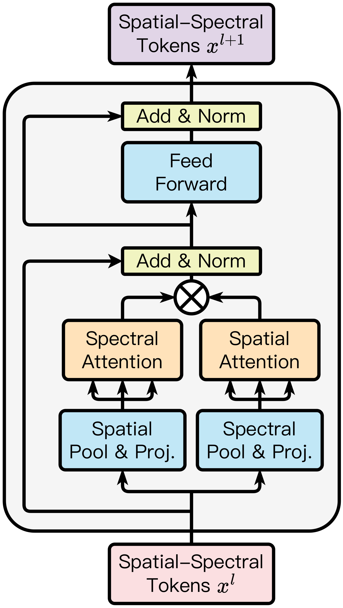

<div align="center">

<h1>Towards Scalable Foundation Model for Multi-modal and Hyperspectral Geospatial Data</h1>

[](https://github.com/uiuctml/GeospatialFM)
[](https://github.com/uiuctml/GeospatialFM)
[](https://github.com/uiuctml/GeospatialFM)
[](https://huggingface.co/GFM-Bench)
[](https://github.com/uiuctml/GFM-Bench)

</div>

This is the official repository for the paper 
"_Towards Scalable Foundation Model for Multi-modal and Hyperspectral Geospatial Data_".  

Authors: 
[Haozhe Si](https://ehzoahis.github.io/),
Yuxuan Wan, 
[Minh Do](https://minhdo.ece.illinois.edu/), 
[Deepak Vasisht](https://deepakv.web.illinois.edu/), 
[Han Zhao](https://hanzhaoml.github.io/), 
Hendrik F. Hamann.

## Overview
This repository provides the implementation of **the Low-rank Efficient Spatial-Spectral Vision Transformer (LESS ViT)**. LESS ViT is a scalable, efficient vision transformer designed specifically for multi-modal and hyperspectral geospatial raster data.
<div align="center">

    <p>LESS ViT</p>
</div>

## GFM-Bench
We also constructed a comprehensive benchmark for geospatial raster data, **GFM-Bench**, which incorporates 3 classification datasets and 4 semantic segmentation datasets. For more detailed information about GFM-Bench, please see [](https://huggingface.co/GFM-Bench) and also our GitHub repository     [](https://github.com/uiuctml/GFM-Bench).

## Pre-training
We pre-trained the **LESS ViT** model using **Hyper-MAE** on the SSL4EO-S12 dataset for 300 epochs (on 8 &times; NVIDIA A6000 GPUs).

To launch pre-training, use `launch_train.sh` script by running:
```shell
bash launch_train.sh
```
and please refer to `GeospatialFM/finetune/args.py`([click here](https://github.com/uiuctml/GeospatialFM/blob/main/GeospatialFM/finetune/args.py)) for more detailed descriptions of arguments in the script.

## Fine-tuning
We fine-tuned and evaluated our pre-trained LESS ViT on **GFM-Bench**. For detailed implementation of fine-tuning experiments, please refer to Appendix C section in our [paper](https://arxiv.org/pdf/2503.12843).

To launch fine-tuning experiments, run the following command:
```shell
python3 sweep_finetune.py \
    --dataset ${DATASET_NAME} \
    --root_dir ${ROOT_DIR}
    --modal ${MODAL} \
```

To launch linear probing experiments, run the following command:
```shell
python3 sweep_finetune.py \
    --dataset ${DATASET_NAME} \
    --root_dir ${ROOT_DIR}
    --modal ${MODAL} \
    --lp
```

- `--dataset ${DATASET_NAME}`: Name of the dataset to use.
- `--root_dir ${ROOT_DIR}`: Directory to save checkpoints and results.
- `--modal ${MODAL}`: The fine-tuning modality (`radar` `optical`, or `multi`). Note: currently only BigEartnet and DFC2020 datasets support `radar` or `multi` fine-tuning in GFM-Bench.

## Model Weights
We will be uploading pre-trained model checkpoints soon. Stay tuned! 😀

## Citation
If you found our project helpful, please cite our paper:
```
@misc{si2025scalablefoundationmodelmultimodal,
      title={Towards Scalable Foundation Model for Multi-modal and Hyperspectral Geospatial Data}, 
      author={Haozhe Si and Yuxuan Wan and Minh Do and Deepak Vasisht and Han Zhao and Hendrik F. Hamann},
      year={2025},
      eprint={2503.12843},
      archivePrefix={arXiv},
      primaryClass={cs.CV},
      url={https://arxiv.org/abs/2503.12843}, 
}
```

## Contact Authors
[Haozhe S](haozhes3@illinois.edu), [Han Zhao](hanzhao@illinois.edu)
